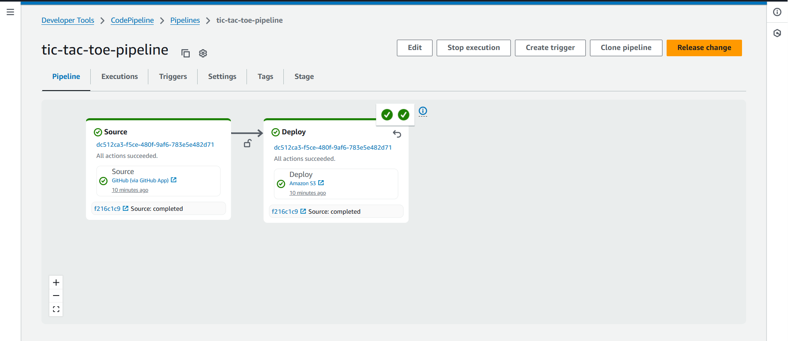

# Static Website CI/CD Pipeline on AWS

## Live Demo
Check out the deployed static website: [View Site](http://auto-pipeline.s3-website.ap-south-1.amazonaws.com)  

---

## Project Overview
This project demonstrates a **complete CI/CD pipeline** for a static website using AWS services.  
It automates the process of deploying HTML, CSS, and JS files from a GitHub repository to a live website.

**Pipeline Flow:**
1. **Source Stage:** GitHub repository containing website files  
2. **Build Stage:** AWS CodeBuild zips the files into `site.zip`  
3. **Deploy Stage:** CodePipeline deploys to an S3 bucket (static website hosting)  
4. **Distribution:** AWS CloudFront caches the site globally and provides HTTPS  

---

## Features
- Fully automated **CI/CD pipeline**  
- **Static website hosting** on S3  
- **CloudFront** distribution for fast, secure, and global access  
- Minimal AWS cost (within free tier)  
- Easy to extend for more files or dynamic assets  

---

## Repository Structure
.
├── index.html # Main HTML page
├── styles.css # Styling for the website
├── script.js # JavaScript logic
└── buildspec.yml # Build instructions for CodeBuild

---

## Pipeline Diagram
  

---

## How to Use
1. **Clone this repo:**
```bash
git clone https://github.com/<your-username>/static-website-ci-cd.git
Push changes to GitHub. The CodePipeline automatically builds and deploys the site.

Visit the live URL to see your changes immediately via CloudFront.

Tech Stack
AWS CodePipeline – orchestrates the CI/CD flow

AWS CodeBuild – builds and packages the website

AWS S3 – hosts the static website

AWS CloudFront – global caching and HTTPS

Future Improvements
Add custom domain with SSL certificate via Route 53

Integrate automatic CloudFront cache invalidation in pipeline

Add more frontend pages or assets

